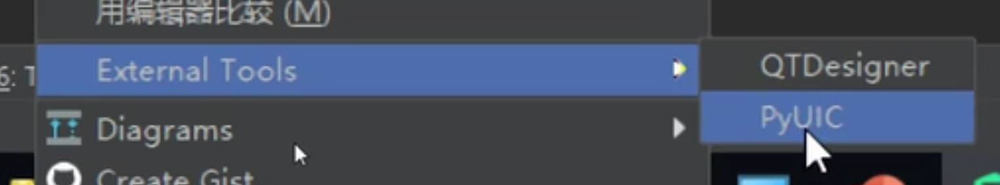

# PyQt5环境搭建

## Pycharm + anaconda3 + PyQt5 开发环境

1. Pycharm 集成开发工具，可集成 Qt 套件
2. Anaconda3 集成各种 Python 套件可用来直接搭建可视化开发环境。在anaconda3的designer程序，可视化设计界面转换为.ui文件
3. 采用pyuic转化.ui文件转为Python可识别的代码，Qt 代码转为 Python 代码的过程。这里的转化核心是库 PyQt5

* 常用 Qt 开发工具 Qt Creator ，其本质也是调用 Qt 库
