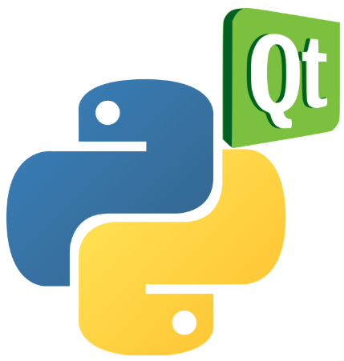
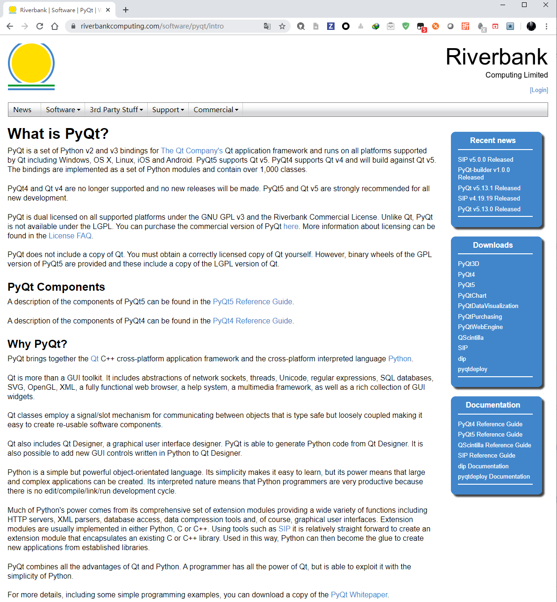

<!-- MDTOC maxdepth:6 firsth1:1 numbering:0 flatten:0 bullets:1 updateOnSave:1 -->

- [PyQt5简介](#pyqt5简介)   
   - [为什么选择 PyQt](#为什么选择-pyqt)   
   - [PyQt发展历史](#pyqt发展历史)   
   - [PyQt组件](#pyqt组件)   
   - [PyQt的优劣](#pyqt的优劣)   
   - [参考](#参考)   

<!-- /MDTOC -->

# PyQt5简介

Python库中支持Qt最佳的库 PyQt

PyQt是Python语言的GUI编程解决方案之一。可以用来代替Python内置的Tkinter。其它替代者还有PyGTK、wxPython等。与Qt一样，PyQt是一个自由软件。PyQt是PyKDE的基础。

PyQt的开发者是英国的“Riverbank Computing”公司。与4.5版本之前的Qt一样，它提供了GPL与商业协议两种授权方式，因此它可以免费地用于自由软件的开发。不过当前尚不提供LGPL授权方式。PyQt可以运行于Microsoft Windows、Mac OS X、Linux以及Unix的多数变种上。

2009年8月，Qt的开发公司诺基亚发布PySide，提供与PyQt类似的功能，但提供了LGPL授权。主要原因是“Riverbank Computing”不愿以LGPL授权发布PyQt。

自4.5版本以后，PyQt同时支持Python 2.x与Python 3.x。但是在API方面有所区别，最主要的是运行在Python 3.x下的PyQt不使用QString，而是str。另外，之前为了避开Python 2.x关键词限制的exec_()、print_()两个函数现在重命名为exec()，print()。

**PyQt5并不向下兼容PyQt4**，主要是由于其有几个较大的改变。虽不兼容，但是旧代码调整到新库并不是很难。

## 为什么选择 PyQt

* <https://riverbankcomputing.com/software/pyqt/intro>

## PyQt发展历史

1. 1998年首次发布，其名为PyKDE，后来改名为PyQt
2. PyQt 3
3. PyQt 4
4. PyQt 5，对Python3支持最为友好，Python对Qt5.*版本的绑定

## PyQt组件

PyQt包含了大约440个类型、超过6000个的函数和方法。

<https://www.riverbankcomputing.com/static/Docs/PyQt5/module_index.html>

* “QtCore”模块主要包含了一些**非GUI的基础功能**，包含事件循环与Qt的信号机制。此外，还提供了跨平台的Unicode、线程、内存映射文件、共享内存、正则表达式和用户设置。
* “QtGui”模块包含了大多数的GUI类型。包含按钮、文本框、列表等常见控件，还包含了基于MVC设计模式的列表、表格、树型控件。同时还提供了一个能够容纳成千上万个元素的画布控件，其中可以放置各种控件和图形。此外，QtGui还支持界面动画与界面状态机编程。
* “QtNetwork”模块可以用于编写非阻塞式的UDP、TCP程序。还包含了DNS、HTTP与FTP的客户端。
* “QtOpenGL”模块允许Qt程序使用OpenGL渲染3D图形，而且不必大量更改代码。
* “QtSql”模块支持多种SQL数据库。包括sqlite、ODBC、MySQL、PostgreSQL、Oracle。还提供了一个基于MVC模式的数据模型，与QtGui的的表格控件配合使用。
* “QtXml”包含一个XML解释器，同时支持SAX和DOM两种编程方式。
* “QtWebkit”与“QtScript”两个子模块支持WebKit与EMCAScript脚本语言
* “Phonon”子模块支持高级的多媒体编程。包含音频播放器、视频播放器与声效处理。
* “uic”子模块能够将Qt的窗体文件转换为Python代码，能够即时读入窗体文件并且显示出来。它依赖于QtXml模块。“QScintilla”子模块包含一个基于Scintilla的文本编辑器控件，Eric IDE使用它作为代码编辑器。“QtMultimedia”提供了底层的多媒体支持，现在多数开发者改用Phonon模块。“QtSvg”支持SVG 1.2 Tiny的静态标准，用于显示与保存SVG格式的图形。

| Enginio             | Classes for accessing Qt Cloud Services \(deprecated\)                      |
|---------------------|-----------------------------------------------------------------------------|
| QAxContainer        | Classes for accessing ActiveX controls and COM objects                      |
| Qt                  | A consolidation of other modules                                            |
| Qt3DAnimation       | Classes that support animations in simulations                              |
| Qt3DCore            | The core classes to support near\-realtime simulation systems               |
| Qt3DExtras          | Pre\-built elements for use with Qt3D                                       |
| Qt3DInput           | Classes to handle user input when using Qt3D                                |
| Qt3DLogic           | Classes that enable frame synchronization                                   |
| Qt3DRender          | Classes that enable 2D and 3D rendering                                     |
| QtAndroidExtras     | Additional classes specific to Android                                      |
| QtBluetooth         | Classes to support connectivity between Bluetooth enabled devices           |
| QtChart             | Classes to support the creation of 2D charts                                |
| QtCore              | The core Qt classes                                                         |
| QtDBus              | Classes to support IPC using the D\-Bus protocol                            |
| QtDataVisualization | Classes to support the visualization of data in 3D                          |
| QtDesigner          | Classes to allow Qt Designer to be extended using Python                    |
| QtGui               | The core classes common to widget and OpenGL GUIs                           |
| QtHelp              | Classes for creating and viewing searchable documentation                   |
| QtLocation          | Classes for creating mapping applications                                   |
| QtMacExtras         | Additional classes specific to macOS and iOS                                |
| QtMultimedia        | Classes for multimedia content, cameras and radios                          |
| QtMultimediaWidgets | Provides additional multimedia related widgets and controls                 |
| QtNetwork           | The core network classes                                                    |
| QtNetworkAuth       | The network authorisation classes                                           |
| QtNfc               | Classes to support connectivity between NFC enabled devices                 |
| QtOpenGL            | Classes for rendering OpenGL in traditional widgets \(deprecated\)          |
| QtPositioning       | Classes for obtaining positioning information from satellite, wifi etc\.    |
| QtPrintSupport      | Classes to make printing easier and more portable                           |
| QtPurchasing        | Classes to support in\-app purchasing from app stores                       |
| QtQml               | Classes for integrating with the QML language                               |
| QtQuick             | Classes for extending QML applications with Python code                     |
| QtQuickWidgets      | Classes for rendering a QML scene in traditional widgets                    |
| QtRemoteObjects     | Classes for sharing the API of a QObject between processes or systems       |
| QtSensors           | Classes for accessing a system's hardware sensors                           |
| QtSerialPort        | Classes for accessing a system's serial ports                               |
| QtSql               | Classes for integrating with SQL databases                                  |
| QtSvg               | Classes providing support for SVG                                           |
| QtTest              | Support for unit testing of GUI applications                                |
| QtWebChannel        | Classes for peer\-to\-peer communication between Python and HTML/JavaScript |
| QtWebEngine         | Classes for integrating QML Web Engine objects with Python                  |
| QtWebEngineCore     | The core Web Engine classes                                                 |
| QtWebEngineWidgets  | A Chromium based web browser                                                |
| QtWebKit            | A WebKit2 based web browser \(deprecated\)                                  |
| QtWebKitWidgets     | A WebKit1 based web browser \(deprecated\)                                  |
| QtWebSockets        | Classes that implement the WebSocket protocol                               |
| QtWidgets           | Classes for creating classic desktop\-style UIs                             |
| QtWinExtras         | Additional classes specific to Windows                                      |
| QtX11Extras         | Additional classes specific to X11                                          |
| QtXml               | Classes for supporting SAX and DOM interfaces to XML                        |
| QtXmlPatterns       | Classes that support additional XML technologies\.                          |
| sip                 | Utilities for bindings developers and users                                 |
| uic                 | Classes for handling the files created by Qt Designer                       |

## PyQt的优劣

优势

* PyQt的API与Qt类似，Qt的文档通常仍然可以应用于PyQt。因此，PyQt的文档比PyGTK、wxPython、Tkinter等GUI编程库的文档丰富得多。
* 如果程序员具备使用Qt的经验，一般很快就可以过渡到PyQt上。而使用PyQt的程序员，如果同时精通C++的话，也可以很快地过渡到Qt平台上。
* 利用SIP，大多数为Qt开发的控件可以方便地port到PyQt。——然而，SIP也需要一些学习成本。
* 有方便的周边工具支持PyQt。如**Qt Designer**，可以使用拖拉式的方法来设计界面，简单易用。**Eric6**，一个使用PyQt设计的Python IDE，对PyQt有特殊的支持。

劣势

* 由于PyQt同时使用Qt以及Python的两种内存管理方法，所以在使用PyQt的过程中要注意避免内存泄露以及悬挂指针[4]。
* 运行时庞大，在Windows平台，只使用PyQt.QtCore与PyQt.QtGui两个子模块时，压缩后至少需要4.09M
* 需要学习一些C++知识，主要是C++类型、内存管理两个方面，以便于阅读Qt文档和理解PyQt的行为。

## 参考

* <https://zh.wikipedia.org/wiki/PyQt>
* <https://zhuanlan.zhihu.com/p/75673557>

---
